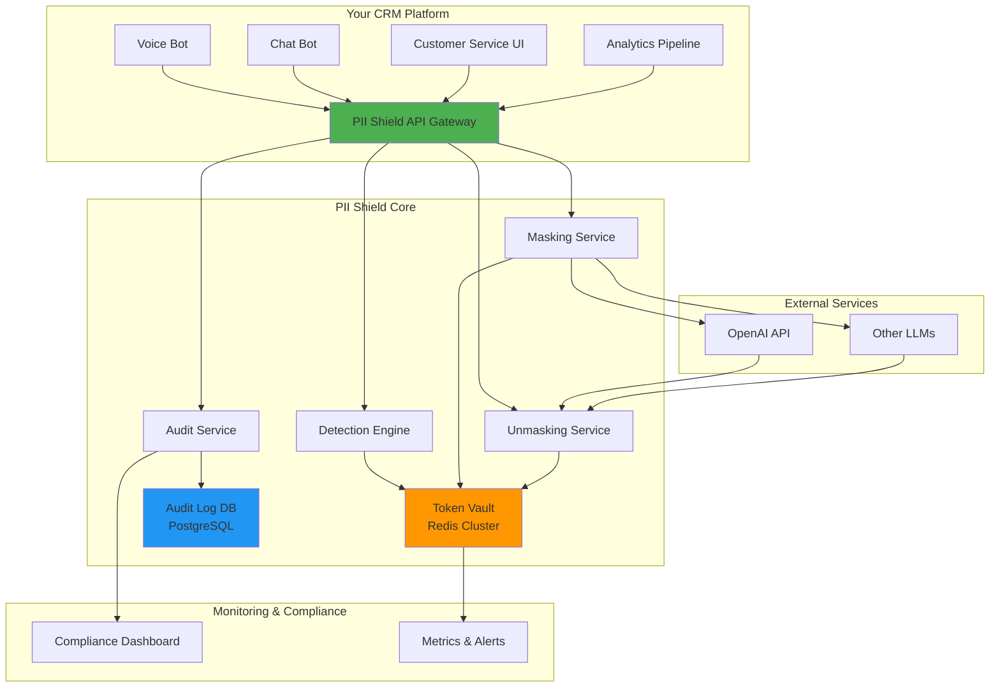
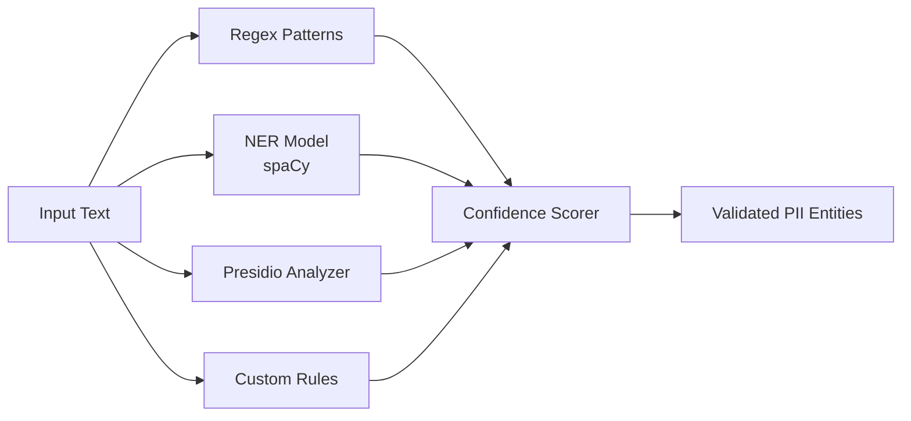
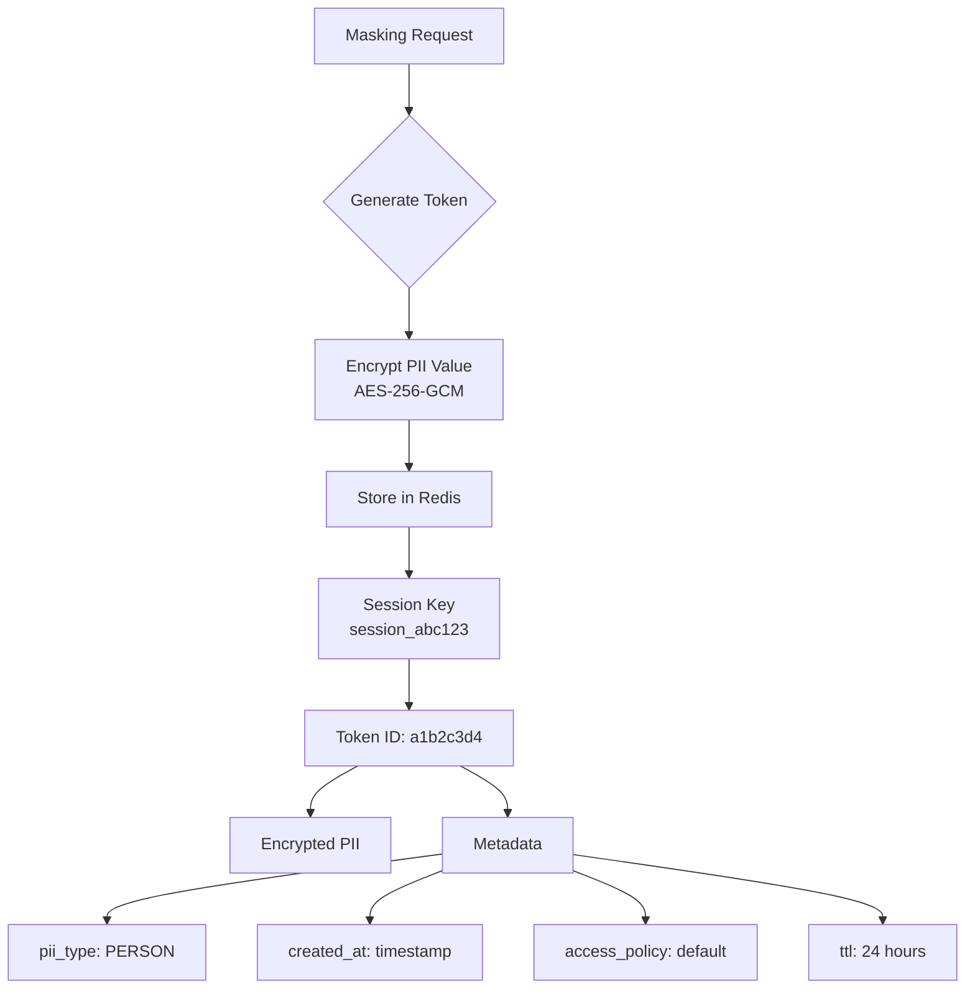
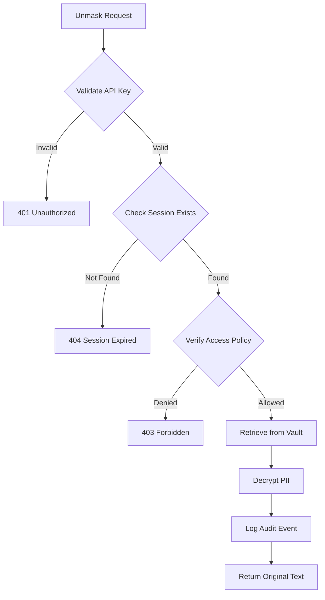
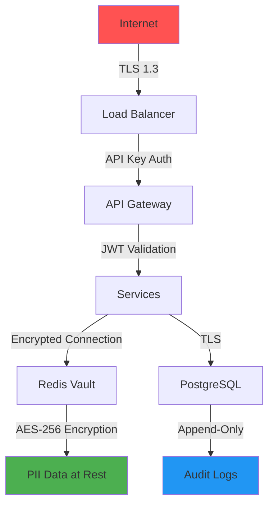

# Technical Architecture: PII Shield Platform

## Architecture Overview

**Design Philosophy**: API-first, stateless services with centralized secure vault - optimized for reliability, simplicity, and enterprise features.

---

## System Architecture: Enhanced Lightweight Middleware



---

## Core Components

### 1. **API Gateway** (Entry Point)

**Responsibility**: Single entry point for all PII operations

**Endpoints**:
```
POST /api/v1/mask          - Mask PII in text
POST /api/v1/unmask        - Restore original PII
POST /api/v1/detect        - Detect PII without masking
GET  /api/v1/audit/{id}    - Retrieve audit logs
GET  /api/v1/health        - Health check
```

**Key Features**:
- Rate limiting (prevent abuse)
- API key authentication
- Request validation
- Error handling with proper HTTP codes

**Technology**: FastAPI (Python) or Express.js (Node.js)

---

### 2. **Detection Engine** (Intelligence Layer)

**Responsibility**: Identify PII with high accuracy and low false positives

**Multi-Strategy Detection**:



**Supported PII Types** (MVP):
- `PERSON` - Names
- `EMAIL` - Email addresses
- `PHONE` - Phone numbers (international)
- `SSN` - Social Security Numbers
- `CREDIT_CARD` - Payment cards
- `ADDRESS` - Physical addresses
- `DATE_OF_BIRTH` - DOB
- `IP_ADDRESS` - IP addresses

**Advanced Features** (Post-MVP):
- `MEDICAL_RECORD` - Healthcare IDs
- `PASSPORT` - Passport numbers
- `IBAN` - Bank account numbers
- Custom entity types per client

**Technology Stack**:
- **Presidio Analyzer** - Rule-based + NER
- **spaCy** (en_core_web_lg) - Context understanding
- **Regex library** - Pattern matching
- **Custom validators** - Business logic

**Accuracy Targets**:
- Precision: >95% (minimize false positives)
- Recall: >90% (catch most PII)
- Latency: <200ms for 1000-word text

---

### 3. **Masking Service** (Transformation Layer)

**Responsibility**: Replace PII with secure tokens

**Masking Strategies**:

| Strategy | Use Case | Example |
|----------|----------|---------|
| **Tokenization** | Reversible, default | `John Doe` → `[PERSON_a1b2c3]` |
| **Redaction** | Irreversible, high security | `John Doe` → `[REDACTED]` |
| **Synthetic** | AI training data | `John Doe` → `Robert Smith` |
| **Partial Masking** | User-friendly display | `john@example.com` → `j***@example.com` |

**Token Format**:
```
[PII_TYPE_UNIQUE_ID]

Examples:
[PERSON_a1b2c3d4]
[EMAIL_e5f6g7h8]
[PHONE_i9j0k1l2]
```

**Token Generation**:
```python
import uuid
import hashlib

def generate_token(pii_value: str, pii_type: str, session_id: str) -> str:
    """
    Generate deterministic token for same PII within session
    """
    # Hash for uniqueness within session
    hash_input = f"{session_id}:{pii_type}:{pii_value}"
    hash_digest = hashlib.sha256(hash_input.encode()).hexdigest()[:8]
    
    return f"[{pii_type}_{hash_digest}]"
```

**Key Properties**:
- **Deterministic**: Same PII → Same token (within session)
- **Reversible**: Token → Original PII (with authorization)
- **Contextual**: Different sessions → Different tokens
- **Format-preserving**: Maintains text structure

---

### 4. **Token Vault** (Secure Storage)

**Responsibility**: Store PII-to-token mappings with encryption

**Architecture**:



**Data Structure** (Redis Hash):
```json
{
  "session_abc123": {
    "a1b2c3d4": {
      "encrypted_value": "gAAAAABf...",
      "pii_type": "PERSON",
      "created_at": "2024-11-30T00:00:00Z",
      "access_policy": "customer_service",
      "allowed_roles": ["agent", "admin"],
      "ttl": 86400
    }
  }
}
```

**Security Features**:
- **Encryption at rest**: AES-256-GCM
- **Encryption in transit**: TLS 1.3
- **Key rotation**: Monthly automatic rotation
- **Access control**: Role-based permissions
- **Auto-expiration**: TTL-based cleanup (default 24h)

**Technology**:
- **Redis Cluster** (3+ nodes for HA)
- **Redis encryption** (TLS + at-rest encryption)
- **Backup**: Hourly snapshots to encrypted S3/Azure Blob

**Scalability**:
- Handles 10,000+ sessions concurrently
- <5ms read/write latency
- Horizontal scaling via Redis Cluster

---

### 5. **Unmasking Service** (Rehydration Layer)

**Responsibility**: Restore original PII with access control

**Access Control Flow**:



**Access Policies**:
```python
{
    "customer_service": {
        "allowed_roles": ["agent", "supervisor", "admin"],
        "allowed_purposes": ["support", "verification"],
        "time_restrictions": "business_hours",
        "require_reason": True
    },
    "analytics": {
        "allowed_roles": ["data_scientist", "admin"],
        "allowed_purposes": ["reporting", "training"],
        "time_restrictions": None,
        "require_reason": False
    }
}
```

**Partial Unmasking** (Advanced):
```python
# Unmask only specific PII types
unmask(text, session_id, allowed_types=["EMAIL", "PHONE"])

# Result: Names stay masked, contact info revealed
```

---

### 6. **Audit Service** (Compliance Layer)

**Responsibility**: Immutable logging of all PII operations

**Audit Event Schema**:
```json
{
  "event_id": "evt_a1b2c3d4e5f6",
  "timestamp": "2024-11-30T00:19:36Z",
  "operation": "UNMASK",
  "session_id": "session_abc123",
  "user_id": "user_xyz789",
  "user_role": "agent",
  "ip_address": "192.168.1.100",
  "pii_types_accessed": ["PERSON", "EMAIL"],
  "purpose": "customer_support",
  "reason": "Verify customer identity",
  "success": true,
  "metadata": {
    "conversation_id": "conv_123",
    "customer_id": "cust_456"
  }
}
```

**Audit Log Features**:
- **Immutable**: Append-only, no deletions
- **Tamper-proof**: Cryptographic hashing (blockchain-style)
- **Queryable**: Full-text search, time-range filters
- **Retention**: 7 years (GDPR compliance)
- **Export**: CSV, JSON for auditors

**Technology**:
- **PostgreSQL** with append-only tables
- **Partitioning** by month for performance
- **Indexes** on user_id, session_id, timestamp
- **Backup** to immutable storage (S3 Glacier)

**Compliance Reports**:
- Who accessed what PII, when, and why
- PII access frequency by user/role
- Anomaly detection (unusual access patterns)
- GDPR Article 30 compliance (processing records)

---

## Data Flow: End-to-End Example

### Scenario: Customer Service Chat

**Step 1: Customer Message**
```
Customer: "My email is john.doe@example.com and phone is +1-555-0123"
```

**Step 2: Mask Request**
```http
POST /api/v1/mask
{
  "text": "My email is john.doe@example.com and phone is +1-555-0123",
  "session_id": "session_abc123",
  "context": {
    "user_id": "agent_001",
    "purpose": "customer_support"
  }
}
```

**Step 3: Detection & Masking**
```json
{
  "masked_text": "My email is [EMAIL_a1b2c3d4] and phone is [PHONE_e5f6g7h8]",
  "entities_detected": [
    {"type": "EMAIL", "value": "john.doe@example.com", "token": "a1b2c3d4"},
    {"type": "PHONE", "value": "+1-555-0123", "token": "e5f6g7h8"}
  ],
  "session_id": "session_abc123"
}
```

**Step 4: Send to LLM**
```python
# Safe to send to OpenAI
response = openai.chat.completions.create(
    messages=[{"role": "user", "content": masked_text}]
)
```

**Step 5: Unmask Response**
```http
POST /api/v1/unmask
{
  "text": "I've updated your email [EMAIL_a1b2c3d4]",
  "session_id": "session_abc123",
  "context": {
    "user_id": "agent_001",
    "purpose": "customer_support",
    "reason": "Display to agent"
  }
}
```

**Step 6: Audit Log Created**
```json
{
  "event_id": "evt_xyz",
  "operation": "UNMASK",
  "user_id": "agent_001",
  "pii_types_accessed": ["EMAIL"],
  "timestamp": "2024-11-30T00:20:00Z"
}
```

---

## Technology Stack

### Core Services
| Component | Technology | Rationale |
|-----------|------------|-----------|
| **API Gateway** | FastAPI (Python) | Fast, async, auto-docs, type hints |
| **Detection** | Presidio + spaCy | Production-ready, extensible |
| **Token Vault** | Redis Cluster | In-memory speed, HA, TTL support |
| **Audit DB** | PostgreSQL | ACID compliance, partitioning |
| **Encryption** | Fernet (symmetric) | Simple, secure, Python-native |

### Infrastructure
| Component | Technology | Rationale |
|-----------|------------|-----------|
| **Containerization** | Docker | Easy deployment, consistency |
| **Orchestration** | Docker Compose (MVP) | Simple, local dev-friendly |
| **Load Balancer** | Nginx | Reverse proxy, SSL termination |
| **Monitoring** | Prometheus + Grafana | Metrics, alerting, dashboards |
| **Logging** | ELK Stack (optional) | Centralized logs, debugging |

### Security
| Component | Technology | Rationale |
|-----------|------------|-----------|
| **API Auth** | JWT tokens | Stateless, scalable |
| **Encryption** | AES-256-GCM | Industry standard |
| **TLS** | Let's Encrypt | Free, auto-renewal |
| **Secrets** | Environment variables | 12-factor app pattern |

---

## Scalability & Reliability

### Performance Targets (MVP)

| Metric | Target | How Achieved |
|--------|--------|--------------|
| **API Latency** | <300ms (p95) | Async processing, Redis caching |
| **Throughput** | 100 req/sec | Horizontal scaling, load balancing |
| **Availability** | 99.5% | Redis HA, health checks, auto-restart |
| **Data Durability** | 99.99% | Redis persistence, PostgreSQL backups |

### Scaling Strategy

**Vertical Scaling** (MVP):
- Single server: 4 CPU, 16GB RAM
- Handles 10,000 sessions, 100 req/sec

**Horizontal Scaling** (Post-MVP):
- API Gateway: Stateless, add more instances
- Redis: Cluster mode, 3-6 nodes
- PostgreSQL: Read replicas for audit queries

### Reliability Features

1. **Health Checks**:
   ```python
   @app.get("/health")
   def health_check():
       return {
           "status": "healthy",
           "redis": redis_client.ping(),
           "database": db.execute("SELECT 1").scalar()
       }
   ```

2. **Circuit Breakers**: Fail fast if Redis/DB down

3. **Retry Logic**: Exponential backoff for transient failures

4. **Graceful Degradation**: 
   - If Redis down → Return error, don't crash
   - If detection slow → Use regex fallback

5. **Rate Limiting**:
   ```python
   # Per API key: 1000 requests/hour
   # Per IP: 100 requests/hour (prevent abuse)
   ```

---

## Security Architecture

### Defense in Depth



### Security Layers

1. **Network**: TLS everywhere, no plaintext
2. **Authentication**: API keys + JWT tokens
3. **Authorization**: Role-based access control
4. **Encryption**: At-rest (AES-256) + in-transit (TLS)
5. **Audit**: Every access logged immutably
6. **Isolation**: Separate Redis instances per environment

### Threat Mitigation

| Threat | Mitigation |
|--------|------------|
| **Data breach** | Encryption, access control, audit logs |
| **Token theft** | Short TTL, session binding, IP validation |
| **Replay attacks** | Nonce in requests, timestamp validation |
| **DDoS** | Rate limiting, API key quotas |
| **Insider threat** | Audit logs, least privilege, separation of duties |

---

## Deployment Architecture

### MVP Deployment (Single Server)

```
┌─────────────────────────────────────┐
│         Docker Host                 │
│                                     │
│  ┌──────────┐  ┌──────────┐       │
│  │  Nginx   │  │ FastAPI  │       │
│  │  :443    │→ │  :8000   │       │
│  └──────────┘  └──────────┘       │
│                      ↓              │
│  ┌──────────┐  ┌──────────┐       │
│  │  Redis   │  │PostgreSQL│       │
│  │  :6379   │  │  :5432   │       │
│  └──────────┘  └──────────┘       │
│                                     │
└─────────────────────────────────────┘
```

**Docker Compose Setup**:
```yaml
version: '3.8'
services:
  api:
    build: ./api
    ports: ["8000:8000"]
    environment:
      - REDIS_URL=redis://redis:6379
      - DATABASE_URL=postgresql://postgres:5432/pii_shield
    depends_on: [redis, postgres]
  
  redis:
    image: redis:7-alpine
    command: redis-server --requirepass ${REDIS_PASSWORD}
    volumes: ["redis_data:/data"]
  
  postgres:
    image: postgres:15-alpine
    environment:
      POSTGRES_DB: pii_shield
      POSTGRES_PASSWORD: ${DB_PASSWORD}
    volumes: ["postgres_data:/var/lib/postgresql/data"]
  
  nginx:
    image: nginx:alpine
    ports: ["443:443"]
    volumes: ["./nginx.conf:/etc/nginx/nginx.conf"]
```

### Production Deployment (Future)

```
┌─────────────────────────────────────┐
│         Cloud Load Balancer         │
└──────────┬──────────────────────────┘
           │
    ┌──────┴──────┐
    │             │
┌───▼───┐     ┌───▼───┐
│ API 1 │     │ API 2 │  (Auto-scaling)
└───┬───┘     └───┬───┘
    │             │
    └──────┬──────┘
           │
    ┌──────▼──────┐
    │ Redis       │
    │ Cluster     │  (3-6 nodes)
    └─────────────┘
           │
    ┌──────▼──────┐
    │ PostgreSQL  │
    │ Primary +   │  (Read replicas)
    │ Replicas    │
    └─────────────┘
```

---

## Integration Patterns

### Pattern 1: Direct API Integration (Recommended)

```python
import requests

class PIIShield:
    def __init__(self, api_key, base_url="https://pii-shield.yourcompany.com"):
        self.api_key = api_key
        self.base_url = base_url
    
    def mask(self, text, session_id, context=None):
        response = requests.post(
            f"{self.base_url}/api/v1/mask",
            json={"text": text, "session_id": session_id, "context": context},
            headers={"Authorization": f"Bearer {self.api_key}"}
        )
        return response.json()
    
    def unmask(self, text, session_id, context=None):
        response = requests.post(
            f"{self.base_url}/api/v1/unmask",
            json={"text": text, "session_id": session_id, "context": context},
            headers={"Authorization": f"Bearer {self.api_key}"}
        )
        return response.json()

# Usage in your CRM
shield = PIIShield(api_key="your_key")
masked = shield.mask("John Doe, john@example.com", session_id="chat_123")
# Send masked["masked_text"] to LLM
```

### Pattern 2: Middleware Wrapper (Transparent)

```python
from pii_shield import PIIShieldMiddleware

# Wrap your LLM client
openai_client = PIIShieldMiddleware(
    openai.ChatCompletion,
    api_key="your_pii_shield_key"
)

# Use normally - masking happens automatically
response = openai_client.create(
    messages=[{"role": "user", "content": "My SSN is 123-45-6789"}]
)
# Response is automatically unmasked
```

### Pattern 3: Webhook Integration (Event-Driven)

```python
# Your CRM sends webhook on new conversation
POST https://pii-shield.yourcompany.com/webhooks/conversation
{
  "conversation_id": "conv_123",
  "messages": [...],
  "callback_url": "https://yourcrm.com/api/masked-conversation"
}

# PII Shield processes and calls back
POST https://yourcrm.com/api/masked-conversation
{
  "conversation_id": "conv_123",
  "masked_messages": [...],
  "session_id": "session_abc123"
}
```

---

## Monitoring & Observability

### Key Metrics

**Performance**:
- API latency (p50, p95, p99)
- Throughput (requests/sec)
- Error rate (4xx, 5xx)

**Business**:
- PII entities detected (by type)
- Sessions created/expired
- Unmask requests (by user/role)

**Security**:
- Failed authentication attempts
- Access policy violations
- Anomalous access patterns

### Dashboards

**Grafana Dashboard** (MVP):
```
┌─────────────────────────────────────┐
│  PII Shield Monitoring              │
├─────────────────────────────────────┤
│  API Latency: 145ms (p95)           │
│  Throughput: 42 req/sec             │
│  Active Sessions: 1,234             │
│  PII Detected (24h): 15,678         │
│    - EMAIL: 5,234                   │
│    - PHONE: 3,456                   │
│    - PERSON: 6,988                  │
│  Unmask Requests: 234               │
│  Audit Events: 456                  │
└─────────────────────────────────────┘
```

---

## Summary: Why This Architecture Works

✅ **Simple**: API-first, minimal components
✅ **Reliable**: Redis HA, PostgreSQL durability, health checks
✅ **Secure**: Encryption, access control, audit logs
✅ **Scalable**: Stateless API, horizontal scaling ready
✅ **Feature-Rich**: Mask + unmask + audit + compliance
✅ **Plug-and-Play**: REST API, easy integration

**This architecture balances MVP speed with production-grade reliability - perfect for a hackathon that can scale to enterprise.**
